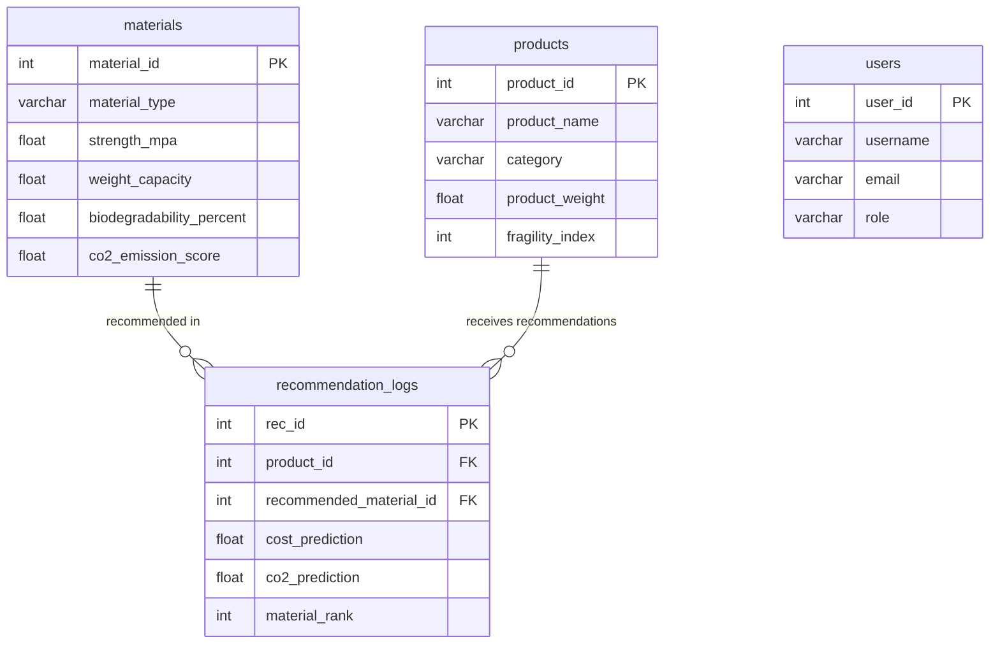

# EcoPackAI Data Dictionary

## Overview
This document describes the database schema for the **EcoPackAI** system, which recommends sustainable packaging materials based on product attributes and environmental impact metrics.

**Database**: `ecopackai_db`  
**Database Engine**: PostgreSQL  
**Last Updated**: 2025-12-04

---

## Table of Contents
1. [materials](#1-materials)
2. [products](#2-products)
3. [recommendation_logs](#3-recommendation_logs)
4. [users](#4-users)

---

## 1. materials

**Purpose**: Stores information about eco-friendly packaging materials with their environmental and physical properties.

| Column Name | Data Type | Constraints | Description | Example Values |
|-------------|-----------|-------------|-------------|----------------|
| `material_id` | SERIAL | PRIMARY KEY | Unique identifier for each material | 1, 2, 3 |
| `material_type` | VARCHAR(100) | NOT NULL | Name/type of packaging material | Paper, Bioplastic, PLA, Cardboard, Sugarcane |
| `strength_mpa` | FLOAT | CHECK >= 0 | Mechanical strength in MegaPascals (MPa) | 25.5, 40.0, 15.2 |
| `weight_capacity` | FLOAT | CHECK >= 0 | Maximum load capacity in kilograms (kg) | 5.0, 10.0, 2.5 |
| `biodegradability_percent` | FLOAT | CHECK 0-100 | Percentage of material that biodegrades naturally | 85.0, 95.5, 60.0 |
| `co2_emission_score` | FLOAT | CHECK >= 0 | Carbon footprint index (lower is better) | 2.5, 5.0, 1.8 |
| `recyclability_percent` | FLOAT | CHECK 0-100 | Percentage indicating reuse/recycling potential | 70.0, 90.0, 50.0 |
| `cost_per_kg` | FLOAT | CHECK >= 0 | Cost per kilogram in INR/USD | 45.50, 120.00, 80.75 |
| `industry_use_case` | VARCHAR(200) | | Primary industries using this material | Electronics, Food, Cosmetics, Pharmacy |
| `created_at` | TIMESTAMP | DEFAULT NOW | Record creation timestamp | 2025-12-04 10:30:00 |
| `updated_at` | TIMESTAMP | DEFAULT NOW | Record last update timestamp | 2025-12-04 14:20:00 |

**Indexes**:
- `idx_material_type` on `material_type`
- `idx_industry_use_case` on `industry_use_case`

---

## 2. products

**Purpose**: Stores product-specific attributes required for intelligent packaging recommendation.

| Column Name | Data Type | Constraints | Description | Example Values |
|-------------|-----------|-------------|-------------|----------------|
| `product_id` | SERIAL | PRIMARY KEY | Unique identifier for each product | 1, 2, 3 |
| `product_name` | VARCHAR(100) | NOT NULL | Name or classification of product | Smartphone, Laptop, Shampoo Bottle |
| `category` | VARCHAR(100) | | Product category type | Electronics, Cosmetics, Food, Pharmacy |
| `product_weight` | FLOAT | CHECK >= 0 | Net weight of the item in kilograms (kg) | 0.5, 1.2, 0.25 |
| `fragility_index` | INT | CHECK 1-10 | Durability requirement (1=sturdy, 10=very fragile) | 8 (smartphone), 5 (shampoo), 2 (canned food) |
| `shipping_type` | VARCHAR(50) | CHECK values | Mode of transportation | Air, Road, Sea, Rail |
| `created_at` | TIMESTAMP | DEFAULT NOW | Record creation timestamp | 2025-12-04 10:30:00 |
| `updated_at` | TIMESTAMP | DEFAULT NOW | Record last update timestamp | 2025-12-04 14:20:00 |

**Indexes**:
- `idx_product_category` on `category`
- `idx_shipping_type` on `shipping_type`

**Shipping Type Values**: `Air`, `Road`, `Sea`, `Rail`

---

## 3. recommendation_logs

**Purpose**: Stores ML model prediction results and material recommendation rankings for each product.

| Column Name | Data Type | Constraints | Description | Example Values |
|-------------|-----------|-------------|-------------|----------------|
| `rec_id` | SERIAL | PRIMARY KEY | Unique identifier for each recommendation | 1, 2, 3 |
| `product_id` | INT | FOREIGN KEY → products | Reference to product being analyzed | 5, 12, 23 |
| `recommended_material_id` | INT | FOREIGN KEY → materials | Reference to recommended material | 3, 7, 15 |
| `cost_prediction` | FLOAT | | Predicted cost for this material-product pairing | 120.50, 85.75, 200.00 |
| `co2_prediction` | FLOAT | | Predicted CO₂ emissions for this pairing | 3.2, 5.1, 2.8 |
| `material_rank` | INT | CHECK >= 1 | Ranking of material (1 = best match) | 1, 2, 3 |
| `confidence_score` | FLOAT | CHECK 0-1 | ML model confidence score (0 to 1) | 0.95, 0.87, 0.72 |
| `created_at` | TIMESTAMP | DEFAULT NOW | Timestamp when prediction was logged | 2025-12-04 10:30:00 |

**Indexes**:
- `idx_rec_product_id` on `product_id`
- `idx_rec_material_id` on `recommended_material_id`
- `idx_rec_created_at` on `created_at`

**Foreign Key Cascade**: `ON DELETE CASCADE` - deleting a product or material will remove associated recommendation logs.

---

## 4. users

**Purpose**: Stores user authentication and authorization data for dashboard access (optional for future use).

| Column Name | Data Type | Constraints | Description | Example Values |
|-------------|-----------|-------------|-------------|----------------|
| `user_id` | SERIAL | PRIMARY KEY | Unique identifier for each user | 1, 2, 3 |
| `username` | VARCHAR(100) | UNIQUE, NOT NULL | Unique username for login | john_doe, admin_user |
| `email` | VARCHAR(150) | UNIQUE, NOT NULL | User email address | john@example.com |
| `password_hash` | VARCHAR(255) | NOT NULL | Hashed password (bcrypt/argon2) | $2b$12$KIX... |
| `role` | VARCHAR(50) | CHECK values, DEFAULT 'user' | User access level | admin, user, viewer |
| `created_at` | TIMESTAMP | DEFAULT NOW | Account creation timestamp | 2025-12-04 10:30:00 |
| `last_login` | TIMESTAMP | | Last successful login timestamp | 2025-12-04 14:20:00 |

**Indexes**:
- `idx_username` on `username`
- `idx_email` on `email`

**Role Values**: `admin`, `user`, `viewer`

---

## Relationships

---

## Data Sources

### Material Dataset Sources
- Environmental protection agency databases
- Material science research papers
- Packaging industry standards (ISO, ASTM)
- Supplier material datasheets

### Product Dataset Sources
- E-commerce product catalogs
- Manufacturing specifications
- Industry categorization standards

---

## Triggers & Automation

### Auto-update Timestamps
- **Trigger**: `materials_update_timestamp` and `products_update_timestamp`
- **Function**: `update_timestamp()`
- **Behavior**: Automatically updates `updated_at` column whenever a record is modified

---

## Notes

1. **Currency Flexibility**: `cost_per_kg` can store values in INR or USD based on deployment region
2. **Fragility Index Scale**: 1 (extremely sturdy, e.g., canned goods) to 10 (extremely fragile, e.g., glass electronics)
3. **CO₂ Emission Score**: Lower values indicate more environmentally friendly materials
4. **Material Rank**: In `recommendation_logs`, rank 1 indicates the best-suited material for that product

---

## Version History

| Version | Date | Author | Changes |
|---------|------|--------|---------|
| 1.0 | 2025-12-04 | EcoPackAI Team | Initial schema design |
| 1.1 | 2025-12-16 | Data Science Team | Added ML features and targets definition |

---

## Features & Targets (ML Model)

### Target Variable

**Primary Target**: `material_type`
- **Type**: Categorical (Multi-class Classification)
- **Description**: The recommended sustainable packaging material
- **Classes**: Cardboard, Paper/Bio-Based, Plastic, Steel
- **Purpose**: Model predicts the most suitable packaging material based on product requirements

**Optional Targets** (Future Enhancement):
- `sustainability_score` (Regression: 0-100)
- `cost_efficiency_category` (Classification: Low/Medium/High)

---

### Feature Groups

#### 1. Material Properties (9 features)

| Feature | Type | Description | Unit | Range |
|---------|------|-------------|------|-------|
| `recyclability_percent` | Float | Percentage of material that can be recycled | % | 0-100 |
| `recycled_content_percent` | Float | Percentage of recycled content in material | % | 0-100 |
| `reusability_percent` | Float | Percentage indicating reuse potential | % | 0-100 |
| `biodegradation_time_days` | Integer | Time for material to biodegrade | days | 0-180000 |
| `end_of_life_disposal_percent` | Float | Disposal efficiency percentage | % | 0-100 |
| `carbon_footprint_kg_co2_unit` | Float | CO₂ emissions per unit | kg CO₂ | 0-5 |
| `co2_emission_per_kg_estimated` | Float | Estimated CO₂ per kg of material | kg CO₂/kg | 0-5 |
| `waste_reduction_impact_percent` | Float | Impact on waste reduction | % | 0-100 |
| `sustainability_target_progress_percent` | Float | Progress toward sustainability goals | % | 0-100 |

#### 2. Packaging Requirements (3 features)

| Feature | Type | Description | Unit | Range |
|---------|------|-------------|------|-------|
| `load_handling_score` | Integer | Material strength for load bearing | score | 1-10 |
| `moisture_resistance_score` | Integer | Resistance to moisture damage | score | 1-10 |
| `thermal_resistance_score` | Integer | Resistance to temperature variations | score | 1-10 |

#### 3. Cost & Operations (4 features)

| Feature | Type | Description | Unit | Range |
|---------|------|-------------|------|-------|
| `cost_per_unit_usd` | Float | Cost per packaging unit | USD | 0.21-25.68 |
| `annual_usage_units` | Integer | Annual usage volume | units | 14649-104546 |
| `total_material_weight_tons` | Float | Total material weight | tons | 145-5092 |
| `supplier_sustainability_compliance_percent` | Float | Supplier compliance with standards | % | 63-100 |

#### 4. Engineered Indices (4 features)

| Feature | Type | Description | Calculation | Range |
|---------|------|-------------|-------------|-------|
| `co2_impact_index` | Float | CO₂ Impact Index (CII) | Composite CO₂ metric | 26-98 |
| `cost_efficiency_index` | Float | Cost Efficiency Index (CEI) | Cost vs. benefit ratio | 44-88 |
| `material_suitability_score` | Float | Material Suitability Score (MSS) | Load + resistance composite | 7-96 |
| `overall_sustainability_score` | Float | Overall Sustainability Score | Weighted sustainability metric | 43-88 |

#### 5. Categorical Features (5 features)

| Feature | Type | Description | Example Values |
|---------|------|-------------|----------------|
| `packaging_type` | String | Type of packaging | Cardboard Boxes, Protective Fillers, Steel Racks |
| `suitable_product_categories` | String | Product categories suited for | Electronics, Food & Beverage, Pharmaceuticals |
| `recommended_packaging_use_cases` | String | Recommended use cases | Last-mile delivery, Void-fill, Secure shipping |
| `supplier_region` | String | Geographic supplier region | APAC, EMEA, AMERICAS, EU, LATAM, ROW |
| `recyclability_category` | String | Recyclability classification | High, Medium, Low |

---

### Feature Summary

| Category | Count | Type |
|----------|-------|------|
| Material Properties | 9 | Numeric |
| Packaging Requirements | 3 | Numeric |
| Cost & Operations | 4 | Numeric |
| Engineered Indices | 4 | Numeric |
| Categorical Features | 5 | Categorical |
| **Total Features** | **25** | **20 Numeric + 5 Categorical** |

---

### Data Files

#### ML-Ready Data
- **X_raw.csv**: Raw feature matrix (404 rows × 25 features)
- **y_raw.csv**: Target variable (404 rows × 1 column)
- **feature_metadata.json**: Feature definitions and metadata

**Location**: `data/ml_ready/`

---

### Business Rules Applied

1. **No Data Leakage**: Target variable excluded from features
2. **No Redundant Fields**: IDs and duplicate columns removed
3. **Consistent Naming**: Standardized feature names
4. **Standardized Units**: kg, days, USD, percentages
5. **Categorical Consistency**: Controlled vocabulary for categorical fields

---
